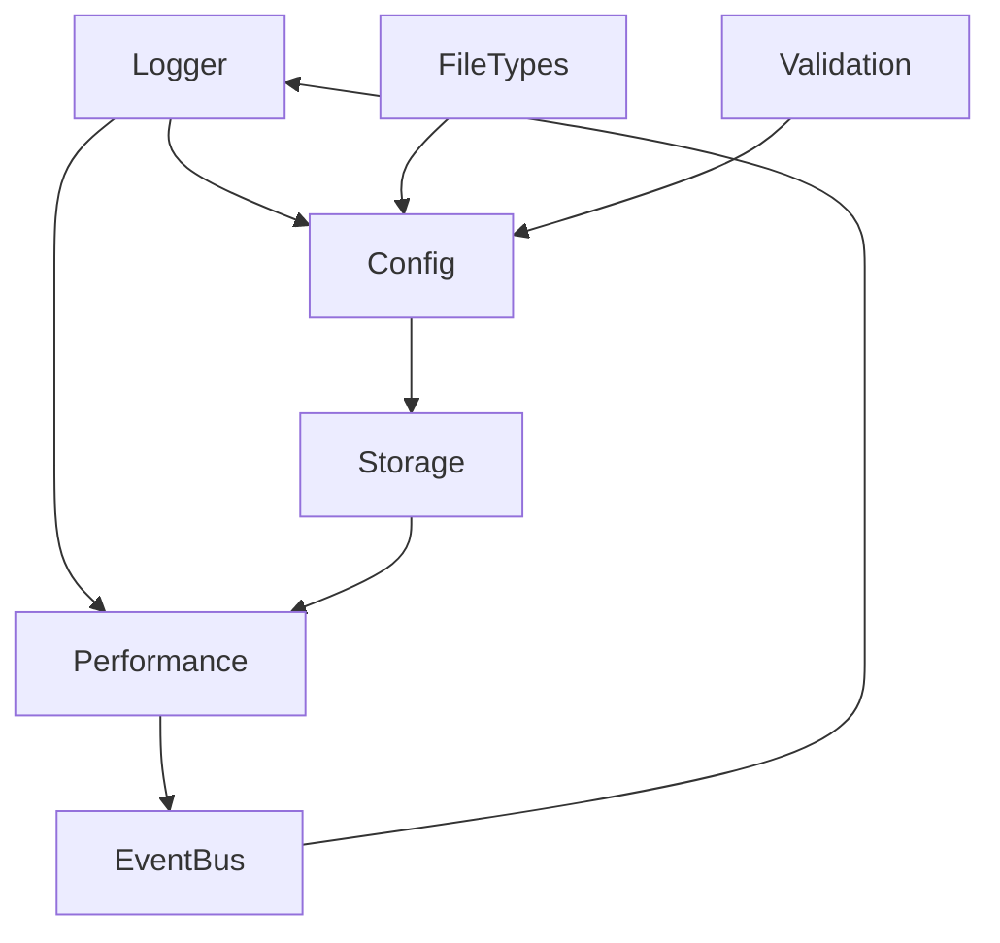

# 🛠️ Utility Modules Documentation - GreatShield

## Overview

This document outlines the utility modules that will be implemented first in Phase 1. These modules provide core functionality that will be used throughout the extension.

## Module Architecture

### Core Principles
- **Single Responsibility**: Each module has one primary purpose
- **Dependency Injection**: Modules are loosely coupled
- **Error First**: Consistent error handling patterns
- **Type Safety**: Full TypeScript type coverage
- **Performance First**: Optimized for Chrome extension environment

### Module Dependencies


## 1. Logger Module (`src/utils/logger.ts`)

### Purpose
- Structured logging system for debugging and monitoring
- Different log levels (DEBUG, INFO, WARN, ERROR)
- Chrome console integration
- Performance tracking
- Memory usage monitoring
- Log grouping and formatting
- Log backup and export

### Key Features
- Log level filtering
- Timestamp and context information
- Performance metrics logging
- Error tracking
- Memory usage monitoring
- Log persistence
- Log rotation
- Source mapping
- Log grouping
- Sensitive data redaction
- Log backup to Chrome storage
- Log export and filtering
- Dynamic log level adjustment

### Implementation Details
```typescript
interface LogEntry {
  timestamp: number;
  level: LogLevel;
  message: string;
  context?: Record<string, unknown>;
  stack?: string;
  source?: string;
  performance?: PerformanceMetric;
  memory?: MemoryMetric;
  group?: string;
}

interface PerformanceMetric {
  duration: number;
  startTime: number;
  endTime: number;
  operation: string;
}

interface MemoryMetric {
  heapUsed: number;
  heapTotal: number;
  external: number;
}

interface LogFormat {
  timestamp: boolean;
  level: boolean;
  context: boolean;
  stack: boolean;
  source: boolean;
  performance: boolean;
  memory: boolean;
}

interface LoggerConfig {
  minLevel: LogLevel;
  persistLogs: boolean;
  maxLogSize: number;
  rotationInterval: number;
  format: LogFormat;
  trackPerformance: boolean;
  trackMemory: boolean;
  memoryCheckInterval: number;
  backupInterval: number;
  sensitiveKeys: string[];
}

class Logger {
  // Core logging methods
  public log(level: LogLevel, message: string, context?: Record<string, unknown>): void;
  public debug(message: string, context?: Record<string, unknown>): void;
  public info(message: string, context?: Record<string, unknown>): void;
  public warn(message: string, context?: Record<string, unknown>): void;
  public error(message: string, error?: Error, context?: Record<string, unknown>): void;

  // Performance tracking
  public startMeasurement(operation: string): void;
  public endMeasurement(operation: string, context?: Record<string, unknown>): void;

  // Log grouping
  public startLogGroup(name: string): void;
  public endLogGroup(): void;

  // Configuration
  public setLogLevel(level: LogLevel): void;
  public getLogs(): LogEntry[];
  public clearLogs(): void;

  // Export and filtering
  public exportLogs(format: 'json' | 'text'): string;
  public filterLogs(options: {
    level?: LogLevel;
    startTime?: number;
    endTime?: number;
    search?: string;
    group?: string;
  }): LogEntry[];

  // Resource management
  public cleanup(): void;
}
```

### Usage Example
```typescript
// Initialize
const logger = Logger.getInstance({
  minLevel: LogLevel.DEBUG,
  persistLogs: true,
  trackPerformance: true,
  trackMemory: true
});

// Basic logging
logger.debug('Scan started', { fileId: 123 });
logger.error('Scan failed', { error: 'Invalid file format' });

// Performance tracking
logger.startMeasurement('scan');
// ... scan operation
logger.endMeasurement('scan', { fileSize: 1024 });

// Log grouping
logger.startLogGroup('File Processing');
logger.info('Processing file', { filename: 'test.pdf' });
logger.debug('File details', { size: 1024, type: 'pdf' });
logger.endLogGroup();

// Dynamic log level
logger.setLogLevel(LogLevel.WARN);

// Export logs
const jsonLogs = logger.exportLogs('json');
const textLogs = logger.exportLogs('text');

// Filter logs
const errorLogs = logger.filterLogs({ level: LogLevel.ERROR });
const recentLogs = logger.filterLogs({
  startTime: Date.now() - 3600000 // Last hour
});

// Cleanup
logger.cleanup();
```

### Error Handling
- Automatic error stack capture
- Context preservation
- Error aggregation
- Recovery suggestions
- Sensitive data redaction
- Circular reference handling
- JSON serialization error handling

### Performance Considerations
- Memory usage monitoring
- Log rotation
- Performance metrics tracking
- Resource cleanup
- Efficient string formatting
- Conditional logging based on level

### Security Features
- Sensitive data redaction
- Secure error messages
- Context sanitization
- Log backup encryption
- Access control

## 2. Config Manager (`src/utils/configManager.ts`)

### Purpose
- Runtime configuration management
- Policy enforcement
- Feature flags
- Performance thresholds

### Key Features
- Configuration validation
- Default values
- Runtime updates
- Policy rules management
- Feature toggles
- Configuration persistence
- Schema validation
- Hot reloading

### Implementation Details
```typescript
interface ConfigSchema {
  [key: string]: {
    type: 'string' | 'number' | 'boolean' | 'object';
    default: unknown;
    validator?: (value: unknown) => boolean;
  };
}

interface ConfigOptions {
  schema: ConfigSchema;
  storage: Storage;
  hotReload?: boolean;
}

class ConfigManager {
  private static instance: ConfigManager;
  private schema: ConfigSchema;
  private values: Map<string, unknown>;
  private storage: Storage;

  private constructor(options: ConfigOptions) {
    this.schema = options.schema;
    this.storage = options.storage;
    this.values = new Map();
    this.initialize();
  }

  public static getInstance(options: ConfigOptions): ConfigManager {
    if (!ConfigManager.instance) {
      ConfigManager.instance = new ConfigManager(options);
    }
    return ConfigManager.instance;
  }

  public get<T>(key: string): T {
    // Implementation
  }

  public set<T>(key: string, value: T): void {
    // Implementation
  }

  // Additional methods
}
```

### Usage Example
```typescript
const config = ConfigManager.getInstance({
  schema: {
    maxFileSize: {
      type: 'number',
      default: 10 * 1024 * 1024,
      validator: (value) => value > 0
    },
    scanTimeout: {
      type: 'number',
      default: 5000,
      validator: (value) => value >= 1000
    }
  },
  storage: chrome.storage.local
});

// Usage
const maxSize = config.get<number>('maxFileSize');
config.set('scanTimeout', 5000);
```

### Error Handling
- Schema validation errors
- Type mismatch errors
- Storage errors
- Hot reload errors

## 3. Storage Manager (`src/utils/storage.ts`)

### Purpose
- Chrome storage API wrapper
- Cache management
- Scan result persistence
- Performance optimization

### Key Features
- TTL-based caching
- Batch operations
- Error handling
- Storage quota management
- Data compression
- Storage migration
- Data versioning
- Automatic cleanup

### Implementation Details
```typescript
interface StorageOptions {
  ttl?: number;
  compress?: boolean;
  version?: number;
}

interface StorageItem<T> {
  value: T;
  timestamp: number;
  ttl?: number;
  version: number;
}

class StorageManager {
  private static instance: StorageManager;
  private storage: chrome.storage.StorageArea;
  private compression: boolean;
  private version: number;

  private constructor(options: Partial<StorageOptions>) {
    this.storage = chrome.storage.local;
    this.compression = options.compress ?? false;
    this.version = options.version ?? 1;
  }

  public static getInstance(options?: Partial<StorageOptions>): StorageManager {
    if (!StorageManager.instance) {
      StorageManager.instance = new StorageManager(options || {});
    }
    return StorageManager.instance;
  }

  public async set<T>(key: string, value: T, options?: StorageOptions): Promise<void> {
    // Implementation
  }

  public async get<T>(key: string): Promise<T | null> {
    // Implementation
  }

  // Additional methods
}
```

### Usage Example
```typescript
const storage = StorageManager.getInstance({
  compress: true,
  version: 1
});

// Usage
await storage.set('scanResult', result, { ttl: 3600 });
const result = await storage.get('scanResult');

// Batch operations
await storage.setMany({
  'config': config,
  'cache': cache
}, { ttl: 86400 });
```

### Error Handling
- Storage quota exceeded
- Compression errors
- Version mismatch
- TTL expiration
- Migration errors

## 4. File Type Manager (`src/utils/fileTypes.ts`)

### Purpose
- File type detection
- MIME type validation
- Extension whitelist management
- Parser selection

### Key Features
- File type validation
- MIME type mapping
- Extension filtering
- Parser registry
- Risk level association
- Magic number detection
- Content sniffing
- Parser caching

### Implementation Details
```typescript
interface FileType {
  mime: string;
  extensions: string[];
  riskLevel: RiskLevel;
  parser?: Parser;
  magicNumbers?: number[];
}

interface Parser {
  parse: (data: ArrayBuffer) => Promise<ParseResult>;
  validate: (data: ArrayBuffer) => Promise<boolean>;
}

class FileTypeManager {
  private static instance: FileTypeManager;
  private types: Map<string, FileType>;
  private parsers: Map<string, Parser>;

  private constructor() {
    this.types = new Map();
    this.parsers = new Map();
    this.initialize();
  }

  public static getInstance(): FileTypeManager {
    if (!FileTypeManager.instance) {
      FileTypeManager.instance = new FileTypeManager();
    }
    return FileTypeManager.instance;
  }

  public registerType(type: FileType): void {
    // Implementation
  }

  public getParser(mime: string): Parser | undefined {
    // Implementation
  }

  // Additional methods
}
```

### Usage Example
```typescript
const fileTypes = FileTypeManager.getInstance();

// Usage
const isSupported = fileTypes.isSupported('application/pdf');
const parser = fileTypes.getParser('docx');

// Register new type
fileTypes.registerType({
  mime: 'application/custom',
  extensions: ['.custom'],
  riskLevel: RiskLevel.MEDIUM,
  parser: customParser
});
```

### Error Handling
- Invalid MIME types
- Parser errors
- Magic number mismatch
- Content validation errors

## 5. Performance Monitor (`src/utils/performance.ts`)

### Purpose
- Performance metrics collection
- Resource usage monitoring
- Benchmark tracking
- Alert generation

### Key Features
- Memory usage tracking
- CPU usage monitoring
- Scan time measurement
- Performance alerts
- Benchmark reporting
- Resource profiling
- Bottleneck detection
- Performance recommendations

### Implementation Details
```typescript
interface PerformanceMetric {
  name: string;
  value: number;
  timestamp: number;
  context?: Record<string, unknown>;
}

interface PerformanceThreshold {
  metric: string;
  threshold: number;
  operator: 'gt' | 'lt' | 'eq';
  action: () => void;
}

class PerformanceMonitor {
  private static instance: PerformanceMonitor;
  private metrics: Map<string, PerformanceMetric[]>;
  private thresholds: PerformanceThreshold[];
  private isMonitoring: boolean;

  private constructor() {
    this.metrics = new Map();
    this.thresholds = [];
    this.isMonitoring = false;
  }

  public static getInstance(): PerformanceMonitor {
    if (!PerformanceMonitor.instance) {
      PerformanceMonitor.instance = new PerformanceMonitor();
    }
    return PerformanceMonitor.instance;
  }

  public startMeasurement(name: string): void {
    // Implementation
  }

  public endMeasurement(name: string): void {
    // Implementation
  }

  // Additional methods
}
```

### Usage Example
```typescript
const performance = PerformanceMonitor.getInstance();

// Usage
performance.startMeasurement('scan');
// ... scan operation
performance.endMeasurement('scan');

// Set threshold
performance.setThreshold({
  metric: 'memory',
  threshold: 100 * 1024 * 1024, // 100MB
  operator: 'gt',
  action: () => logger.warn('High memory usage detected')
});
```

### Error Handling
- Measurement errors
- Resource exhaustion
- Threshold violations
- Monitoring failures

## 6. Event Bus (`src/utils/eventBus.ts`)

### Purpose
- Event-driven architecture
- Component communication
- State management
- Error propagation

### Key Features
- Event subscription
- Event publishing
- Error handling
- Event filtering
- State management
- Event persistence
- Event replay
- Dead letter queue

### Implementation Details
```typescript
interface Event<T = unknown> {
  type: string;
  payload: T;
  timestamp: number;
  source?: string;
}

interface EventHandler<T = unknown> {
  (event: Event<T>): void | Promise<void>;
}

class EventBus {
  private static instance: EventBus;
  private handlers: Map<string, Set<EventHandler>>;
  private eventLog: Event[];
  private isReplaying: boolean;

  private constructor() {
    this.handlers = new Map();
    this.eventLog = [];
    this.isReplaying = false;
  }

  public static getInstance(): EventBus {
    if (!EventBus.instance) {
      EventBus.instance = new EventBus();
    }
    return EventBus.instance;
  }

  public subscribe<T>(type: string, handler: EventHandler<T>): () => void {
    // Implementation
  }

  public publish<T>(type: string, payload: T): void {
    // Implementation
  }

  // Additional methods
}
```

### Usage Example
```typescript
const eventBus = EventBus.getInstance();

// Usage
const unsubscribe = eventBus.subscribe('SCAN_COMPLETED', (event) => {
  console.log('Scan completed:', event.payload);
});

eventBus.publish('SCAN_STARTED', { fileId: 123 });

// State management
eventBus.subscribe('STATE_CHANGED', (event) => {
  updateUI(event.payload);
});
```

### Error Handling
- Handler errors
- Event validation
- Replay errors
- Queue overflow

## 7. Validation Utils (`src/utils/validation.ts`)

### Purpose
- Input validation
- Data sanitization
- Type checking
- Error generation

### Key Features
- Schema validation
- Type guards
- Error formatting
- Sanitization rules
- Custom validators
- Validation caching
- Cross-field validation
- Async validation

### Implementation Details
```typescript
interface ValidationRule<T> {
  validate: (value: T) => boolean | Promise<boolean>;
  message: string;
}

interface ValidationSchema<T> {
  [K in keyof T]: ValidationRule<T[K]>[];
}

class ValidationManager {
  private static instance: ValidationManager;
  private schemas: Map<string, ValidationSchema<unknown>>;
  private cache: Map<string, boolean>;

  private constructor() {
    this.schemas = new Map();
    this.cache = new Map();
  }

  public static getInstance(): ValidationManager {
    if (!ValidationManager.instance) {
      ValidationManager.instance = new ValidationManager();
    }
    return ValidationManager.instance;
  }

  public registerSchema<T>(name: string, schema: ValidationSchema<T>): void {
    // Implementation
  }

  public validate<T>(name: string, data: T): Promise<ValidationResult> {
    // Implementation
  }

  // Additional methods
}
```

### Usage Example
```typescript
const validation = ValidationManager.getInstance();

// Usage
const schema = {
  filename: [
    {
      validate: (value) => /^[a-zA-Z0-9.-]+$/.test(value),
      message: 'Invalid filename'
    }
  ],
  size: [
    {
      validate: (value) => value > 0 && value < 10 * 1024 * 1024,
      message: 'File too large'
    }
  ]
};

validation.registerSchema('file', schema);
const result = await validation.validate('file', {
  filename: 'test.pdf',
  size: 1024
});
```

### Error Handling
- Validation errors
- Schema errors
- Type errors
- Async validation failures

## Implementation Order

1. Logger Module
   - Essential for debugging and development
   - Used by all other modules
   - Priority: Highest

2. Config Manager
   - Core configuration needed by other modules
   - Policy enforcement foundation
   - Priority: High

3. Storage Manager
   - Required for caching and persistence
   - Performance critical
   - Priority: High

4. File Type Manager
   - Core file handling functionality
   - Used by scanner
   - Priority: Medium

5. Performance Monitor
   - Required for optimization
   - Used to track resource usage
   - Priority: Medium

6. Event Bus
   - Component communication
   - State management
   - Priority: Medium

7. Validation Utils
   - Input validation
   - Type safety
   - Priority: Low

## Testing Strategy

### Unit Tests
- Each utility module
- Edge cases
- Error conditions
- Performance benchmarks

### Integration Tests
- Module interactions
- Event flow
- State management
- Error propagation

### Performance Tests
- Memory usage
- CPU usage
- Response time
- Resource utilization

### Security Tests
- Input validation
- Error handling
- Access control
- Data protection

## Performance Considerations

### Memory Management
- Object pooling
- Garbage collection
- Memory leaks prevention
- Resource cleanup

### Async Operations
- Promise handling
- Error propagation
- Timeout management
- Retry logic

### Cache Strategy
- LRU cache
- TTL management
- Cache invalidation
- Storage optimization

### Event System
- Event batching
- Debouncing
- Throttling
- Queue management

## Security Considerations

### Input Validation
- Schema validation
- Type checking
- Sanitization
- Encoding

### Storage Security
- Data encryption
- Access control
- Secure storage
- Data integrity

### Error Handling
- Secure error messages
- Error logging
- Error recovery
- Error reporting

### Access Control
- Permission checking
- Role-based access
- Resource limits
- Security policies

## Best Practices

### Code Organization
- Single responsibility
- Dependency injection
- Interface segregation
- Open/closed principle

### Error Handling
- Error first callbacks
- Promise rejection
- Error boundaries
- Error recovery

### Performance
- Lazy loading
- Caching
- Resource pooling
- Memory management

### Testing
- Test-driven development
- Coverage requirements
- Performance testing
- Security testing

## Maintenance

### Monitoring
- Performance metrics
- Error rates
- Resource usage
- User feedback

### Updates
- Version management
- Migration strategy
- Backward compatibility
- Feature flags

### Documentation
- API documentation
- Usage examples
- Best practices
- Troubleshooting

### Support
- Error reporting
- User feedback
- Bug tracking
- Feature requests 