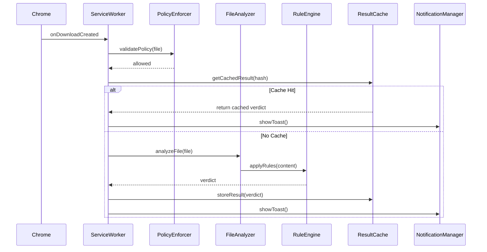
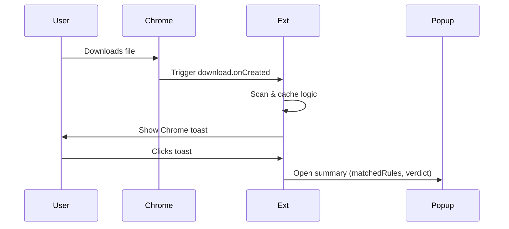

# 📦 GreatShield – Engineering Blueprint

---

## 1. System Overview

GreatShield is a lightweight Chrome extension that provides document-level threat protection by intercepting downloads and applying static rule-based scanning. Designed for minimal latency and full local privacy, it avoids traditional AV bloat by focusing on high-risk but Chrome-ignored file types.

---

## 2. Architecture Summary

### 📐 Key Modules

| Module               | Role |
|----------------------|------|
| `ServiceWorker`      | Handles download event interception and routing |
| `PolicyEnforcer`     | Applies size/extension-based filtering policy |
| `FileAnalyzer`       | Parses file, extracts text, hashes |
| `RuleEngine`         | Matches parsed content against regex signatures |
| `ResultCache`        | Uses `chrome.storage.local` to cache verdicts |
| `NotificationManager`| Displays Chrome toast + handles popup flow |
| `SmartScanGateway`   | Stubbed Tier 2 cloud submission placeholder |

---

### 🧩 Core Data Flow



---

## 3. Supported File Types

```ts
const MONITORED_EXTENSIONS = [
  "pdf", "docx", "docm", "xlsx", "xlsm", "pptx", "pptm",
  "rtf", "csv", "one", "eml", "msg", "zip", "rar", "7z", 
  "iso", "vhd", "html", "htm", "svg", "md"
];
```

These file types are not blocked by Chrome but are often weaponized.

---

## 4. Core Interfaces

### Download Metadata

```ts
interface DownloadEvent {
  id: number;
  filename: string;
  mime: string;
  url: string;
  fileSize: number;
  extension: string;
  timestamp: number;
}
```

### Verdict Format

```ts
type ScanVerdict = 'safe' | 'suspicious' | 'blocked' | 'skipped';

interface AnalysisResult {
  fileHash: string;
  verdict: ScanVerdict;
  matchedRules: string[];
  scannedAt: number;
  durationMs: number;
}
```

### Policy Definition

```ts
interface Policy {
  maxFileSizeMB: number;
  allowedExtensions: string[];
  enableCaching: boolean;
}
```

---

## 5. User Interaction Flow



---

## 6. Key Use Cases

- **UC1**: Scan downloaded file → display toast
- **UC2**: Click toast → show verdict in popup
- **UC3**: Same file downloaded again → reuse cached result

---

## 7. Test Strategy

| Layer | Tool | Target |
|-------|------|--------|
| Unit | Jest | PolicyEnforcer, FileAnalyzer, RuleEngine, Cache |
| Integration | Jest | Download → Scan → Notify |
| E2E | Playwright | Simulated user downloads & interactions |

---

## 8. CI/CD Pipeline

| Step | Command |
|------|---------|
| Lint | `npm run lint` |
| Type Check | `npm run type-check` |
| Unit Test | `npm run test:unit` |
| E2E Test | `npm run test:e2e` |
| Build | `npm run build` |

GitHub Actions runs all steps and enforces 90%+ coverage.

---

## 9. Out-of-Scope (Tier 2+)

- Cloud sandbox submission (stub only)
- Remote rule loading
- Cross-browser support (Chrome-only for Phase 1)

---

## 10. Privacy Assurance

- All scanning is fully local
- No file leaves the machine unless user explicitly consents (future)
- `chrome.storage.local` used for non-sensitive hash cache only

---

