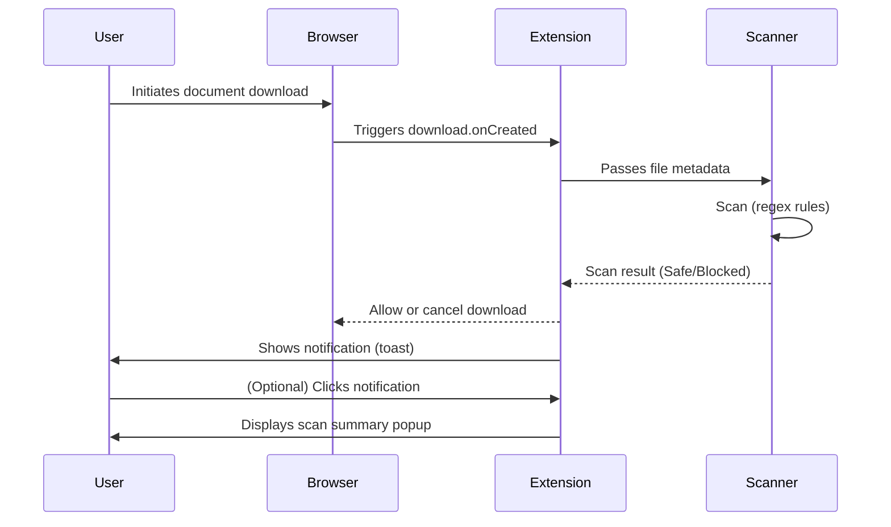

# 📘 Use Cases & User Stories – *GreatShield*

---

## 1. Purpose

This document describes key interaction scenarios and workflows that demonstrate how users and system components interact with the GreatShield Chrome extension. It provides both **use cases (behavioral flows)** and **user stories (Agile-oriented feature descriptions)** for Phase 1 implementation.

---

## 2. Primary Actor

- **End User**: A technically capable user (developer, power user) who installs and runs the GreatShield extension in Chrome to prevent potentially malicious documents from being downloaded.

---

## 3. Use Case Scenarios

### Use Case UC1: Intercept and Scan Downloaded Document

| Element | Description |
|--------|-------------|
| **ID** | UC1 |
| **Title** | Intercept and Scan Downloaded Document |
| **Actor** | End User |
| **Trigger** | A file with a scanable extension (e.g., `.pdf`, `.docx`, `.zip`) is downloaded |
| **Preconditions** | Extension is installed and active. Developer mode or production mode enabled. |
| **Main Flow** |
1. User initiates a file download in Chrome.
2. Extension captures the event via `chrome.downloads.onCreated`.
3. The file's metadata (extension, size) is checked against the policy.
4. If eligible, the file is scanned using static rules (e.g., regex).
5. Scan results are stored (cached) locally.
6. A notification (toast) is displayed showing "Safe" or "Blocked".
| **Postconditions** | The file is either blocked or allowed based on scan result. |
| **Exceptions** |
- File type is not supported → Scan is skipped.
- File too large → Skipped with warning.
- Internal error → Download allowed, warning displayed.

---

### Use Case UC2: Show Scan Summary on Notification Click

| Element | Description |
|--------|-------------|
| **ID** | UC2 |
| **Title** | Show Scan Summary on Notification Click |
| **Actor** | End User |
| **Trigger** | User clicks the toast notification shown after a scan |
| **Main Flow** |
1. User clicks a toast notification after a file scan.
2. A popup is displayed showing file name, scan result, signature matched (if any), and timestamp.
| **Postconditions** | User can review why a file was allowed or blocked. |

---

### Use Case UC3: Avoid Rescanning Identical Files

| Element | Description |
|--------|-------------|
| **ID** | UC3 |
| **Title** | Avoid Rescanning Identical Files |
| **Actor** | System |
| **Trigger** | A previously scanned file is downloaded again |
| **Main Flow** |
1. File hash is computed on download.
2. Hash is looked up in the IndexedDB cache.
3. If a match is found, the previous result is reused.
4. Notification is shown immediately without rescanning.
| **Postconditions** | File is treated based on prior result. |

---

## 4. User Stories (Agile Format)

### 🔹 Story 1: Basic Document Protection

> **As a** security-conscious user,  
> **I want** the extension to automatically scan downloaded documents,  
> **so that** I can avoid accidentally opening malicious files.

### 🔹 Story 2: Scan Result Feedback

> **As a** user,  
> **I want** to receive a notification about whether the file was safe or blocked,  
> **so that** I can make an informed decision before opening it.

### 🔹 Story 3: Efficient Re-download Behavior

> **As a** returning user,  
> **I want** the extension to remember previous scans of the same file,  
> **so that** I don’t waste time re-scanning files I already verified.

### 🔹 Story 4: Support for Custom File Types (Future Tier)

> **As a** power user or admin,  
> **I want** to define my own set of file extensions and rules,  
> **so that** the scanner can be tailored to my threat model.

### 🔹 Story 5: Privacy Respect

> **As a** privacy-conscious user,  
> **I want** the scanning to happen entirely locally,  
> **so that** no file is uploaded to external servers without my consent.

---

## 5. Out-of-Scope Scenarios (Tier 2+)

| Scenario | Reason |
|----------|--------|
| Dynamic sandbox detonation | Requires server-side infrastructure |
| Centralized scan result sharing | Not part of local-only Tier 1 design |
| Admin console for rule management | Will be considered in Tier 2+ roadmap |

---

## 6. UI Interaction Diagram (Mermaid)

---