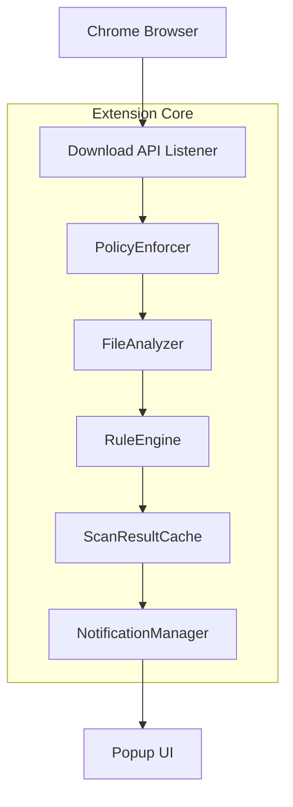
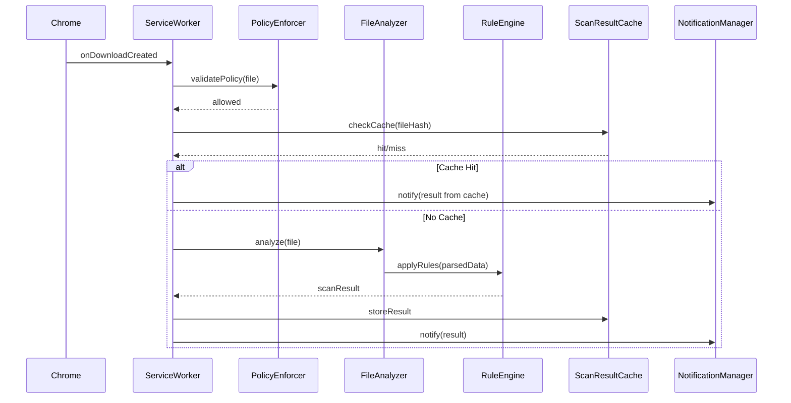

# 📐 Technical Design Document – *GreatShield*

---

## 1. Purpose

This document defines the system architecture, component responsibilities, data flow, and design rationale of the GreatShield Chrome extension. It provides a solid technical blueprint for developers and contributors involved in Phase 1 implementation.

---

## 2. Project Structure

```plaintext
GreatShield/
├── manifest.json                 # Chrome extension manifest
├── package.json                  # NPM dependencies & scripts
├── tsconfig.json                 # TypeScript configuration
├── webpack.config.js             # Build configuration (bundling)
├── jest.config.js                # Unit test configuration
├── playwright.config.ts          # E2E test configuration
├── .eslintrc.js                  # Linting rules
├── .prettierrc                   # Code formatting rules
├── .github/
│   └── workflows/
│       ├── ci.yml                # CI pipeline (lint, test, build)
│       └── deploy.yml            # Chrome Web Store deploy workflow
├── src/                          # Source code
│   ├── background/               # Core background scripts
│   │   ├── serviceWorker.ts      # ServiceWorker implementation
│   │   ├── eventBus.ts           # EventBus implementation
│   │   ├── downloadScanner.ts    # DownloadScanner module
│   │   ├── policyEnforcer.ts     # PolicyEnforcer module
│   │   ├── fileAnalyzer.ts       # FileAnalyzer module
│   │   ├── ruleEngine.ts         # RuleEngine module
│   │   ├── notificationManager.ts# NotificationManager module
│   │   └── smartScanGateway.ts   # SmartScanGateway stub
│   ├── utils/                    # Utility components
│   │   ├── logger.ts             # Logger implementation
│   │   ├── configManager.ts      # ConfigManager implementation
│   │   ├── fileTypes.ts          # FileTypes definitions
│   │   ├── storage.ts            # Storage wrapper
│   │   └── index.ts              # Utilities entrypoint
│   ├── types/                    # Shared types & interfaces
│   │   ├── interfaces.ts         # TypeScript interface definitions
│   │   ├── models.ts             # Data models (AnalysisResult, ScanVerdict)
│   │   └── index.d.ts            # Global type declarations
│   └── assets/                   # Static assets
│       ├── icon16.png            # Extension icon (16×16)
│       ├── icon48.png            # Extension icon (48×48)
│       └── icon128.png           # Extension icon (128×128)
├── tests/                        # Test suites
│   ├── unit/                     # Unit tests (Jest)
│   │   ├── serviceWorker.spec.ts
│   │   ├── downloadScanner.spec.ts
│   │   └── ...
│   └── e2e/                      # End-to-end tests (Playwright)
│       ├── intercept.spec.ts
│       └── notification.spec.ts
└── docs/                         # Documentation
    ├── architecture.md           # Architecture overview
    ├── interface-reference.md    # Interface definitions
    ├── phase1-todo.md            # Tier 1 Phase tasks
    └── roadmap.md                # Project roadmap
```

---

## 3. High-Level Architecture



---

## 4. Key Components

### 4.1. `ServiceWorker`
Handles all download interception and dispatches events via `EventBus`.

### 4.2. `PolicyEnforcer`
Applies rules such as file size limits and extension whitelist from `ConfigManager`.

### 4.3. `FileAnalyzer`
Parses file content (PDF.js, Office format) and generates hashes.

### 4.4. `RuleEngine`
Evaluates the content using static signature-based regex rules and returns threat verdicts.

### 4.5. `ScanResultCache`
Caches file hashes and scan results in IndexedDB to prevent redundant scans.

### 4.6. `NotificationManager`
Uses the Chrome API to show toast notifications and handles clicks to trigger detailed popup display.

### 4.7. `Popup UI`
Displays file name, result status, rule matches, and time.

---

## 5. Data Flow



---

## 6. CI/CD Overview

- GitHub Actions (`ci.yml`):
  - `lint` → `type-check` → `test` → `build`
- Deployment: `deploy.yml` builds and publishes to Chrome Web Store

---

## 7. Future Enhancements

| Feature | Status |
|--------|--------|
| SmartScanGateway → Cloud sandbox API | Stubbed, planned for Tier 2 |
| Remote config management | Not implemented |
| User-defined rule imports | Not implemented |

---